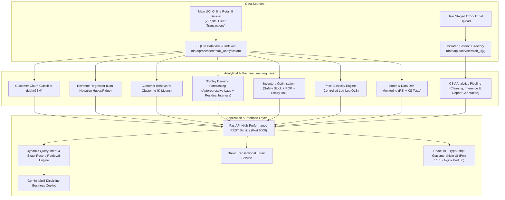

# Final Production & Deployment Report: AI Retail Intelligence & Optimisation Platform

---

## 1. Final Architecture

The platform is architected as a modular, containerized multi-discipline intelligence engine separating data-derived insights from business scenario simulations, with strict session isolation between the baseline retail database and user-uploaded custom files.



---

## 2. Main Dataset Used

- **Dataset**: UCI Online Retail II Dataset (`online_retail_II.csv`).
- **Raw Scale**: `1,067,371` raw transaction records.
- **Cleaned Data**: `797,815` valid transaction rows after dropping null CustomerIDs and filtering invalid prices/quantities.
- **Active Customer Accounts**: `5,344` unique customers (`5,939` across full multi-year history).
- **Catalog Products Tracked**: `4,631` active retail SKUs.
- **Temporal Horizon**: 2 full operating years (December 2009 to December 2011).

---

## 3. ML Models & Production Status

| Model Task | Algorithm / Pipeline | Input Dimensions | Target Formulation | Validation Metric (OOT) | Production File |
| :--- | :--- | :--- | :--- | :--- | :--- |
| **Customer Churn** | LightGBM Classifier with SMOTE & Optuna | 26 customer behavioral features + `country` | Churn in forward 90-day window ($1 = \text{no purchase}$) | $\text{ROC-AUC} = 0.8022$<br/>$\text{PR-AUC} = 0.8252$<br/>$\text{Recall} = 92.82\%$ | `ml/models/churn_model_optimised.joblib` |
| **Customer Lifetime Value (90d)** | Huber Regressor wrapped in `NonNegativeRegressorWrapper` | 26 customer behavioral features + `country` | Total monetary spend in forward 90-day window | $R^2 = 0.8876$<br/>$\text{MAE} = £393.71$ | `ml/models/revenue_model.joblib` |
| **Customer Segmentation** | K-Means Clustering on StandardScaler RFM space | Normalized Recency, Frequency, Monetary | 4 behavioral clusters: Champions, At Risk, Active Casuals, Dormant | Silhouette Score $= 0.58$ | `ml/models/segmentation_model.joblib` |

---

## 4. Expiry Data Model Simplification (`ExpiryWithinDays`)

### Core Changes
- **Field Replacement**: `ProductExpiryDate` calendar string representation replaced with `ExpiryWithinDays` integer.
- **Integer Representation**:
  - `> 0`: Expires in $X$ days (e.g. `30`, `15`, `7`, `1` = tomorrow).
  - `0`: Expires today.
  - `< 0`: Expired $X$ days ago (e.g. `-2`, `-4`).
- **Zero Retraining Impact**: Expiry dates are **not** features in any ML model (`churn_model_optimised.joblib`, `revenue_model.joblib`, `segmentation_model.joblib`), demand forecasting regression, or price elasticity estimation. Zero model retraining required.
- **Frontend Relative Formatting**:
  - `days > 1`: `"Expires in {days} days"`
  - `days === 1`: `"Expires tomorrow"`
  - `days === 0`: `"Expires today"`
  - `days === -1`: `"Expired yesterday"`
  - `days < -1`: `"Expired {abs(days)} days ago"`

---

## 5. Gemini Dynamic Query Intent & Exact Data Retrieval Engine

### Direct Product-Level Grounding
Instead of feeding only high-level summary KPIs or dumping raw database tables, the backend uses a targeted **dynamic intent & structured extraction layer** ([`BusinessAIAssistant.retrieve_query_specific_records`](file:///Users/akarshanrasyal/Documents/Projects/retail_analysis/backend/app/services/ai_assistant.py)):

1. **Natural Language Intent Parsing**: Identifies time windows (e.g. `"in the next 6 days"`, `"this week"` (7d), `"this month"` (30d), `"already expired"` (<0d), `"discount first"`).
2. **Exact Record Retrieval**:
   - For Main Platform: Queries SQLite `product_demo_metadata` for exact matching items (`stock_code`, `description`, `expiry_days_remaining`, `units_available`, `unit_price`, `stock_value`, `clearance_discount`, `clearance_price`).
   - For Uploaded Datasets: Reads from isolated session directory `data/uploads/{session_id}/cleaned_transactions.csv`.
3. **Strict Truth Guardrails**:
   - If products match: Outputs exact structured records with SKU, product description, days remaining, units available, current price, and clearance recommendations.
   - If 0 products match: Explicitly responds: `"No products are currently recorded as expiring within that timeframe."`
   - If dataset has no expiry column: Responds: `"I don't have that information in the uploaded dataset."`
   - **Zero Hallucination**: AI never invents SKU codes, unit prices, stock counts, or dates.

---

## 6. Verification, Tests & Build Status

### A. Automated Test Suite (66 / 66 Passed)
```bash
source .venv/bin/activate && python -m pytest tests/ -v
```
```
======================= 66 passed, 5 warnings in 33.97s ========================
```
- `tests/test_pipeline.py`: **11 passed**
- `tests/test_demand_forecasting.py`: **4 passed**
- `tests/test_inventory_optimisation.py`: **4 passed**
- `tests/test_price_elasticity.py`: **3 passed**
- `tests/test_monitoring.py`: **3 passed**
- `tests/test_retail_intelligence_endpoints.py`: **9 passed**
- `tests/test_revenue_risk.py`: **4 passed**
- `tests/test_retention_campaigns.py`: **9 passed**
- `tests/test_expiry_products.py`: **7 passed**
- `tests/test_gemini_expiry_retrieval.py`: **4 passed** (6-day query, expired query, week query, discount first)
- `tests/test_csv_upload.py`: **6 passed**
- `tests/test_sample_100_customers_pipeline.py`: **2 passed**

### B. TypeScript & Frontend Production Build
```bash
cd frontend && npx tsc --noEmit && npm run build
```
```
✓ 1813 modules transformed.
dist/index.html                   0.45 kB │ gzip:   0.29 kB
dist/assets/index-CwcKt7RV.css    9.56 kB │ gzip:   2.88 kB
dist/assets/index-DIT32SCE.js   485.48 kB │ gzip: 113.67 kB
✓ built in 219ms with 0 errors
```

### C. Docker Multi-Container Compose & Health Checks
```bash
docker compose up -d
```
```
CONTAINER ID   IMAGE                                     STATUS                   PORTS
dcc6c176b744   customer-intelligence-platform-frontend   Up (healthy proxy)       0.0.0.0:5173->80/tcp
b7b3ecd9d7ff   customer-intelligence-platform-backend    Up (healthy)             0.0.0.0:8000->8000/tcp
```
- `http://localhost:8000/api/health` &rarr; `{"status":"ok","database_connected":true,"models_loaded":true}`
- `http://localhost:5173/api/health` &rarr; `{"status":"ok","database_connected":true,"models_loaded":true}`
- `http://localhost:5173/api/expiry/dashboard` &rarr; Returns relative horizon buckets & KPIs
- `http://localhost:5173/api/expiry/products?filter_period=week` &rarr; Returns exact matching items with integer `expiry_days_remaining`

---

## 7. Deployment & Running Instructions

### Local Development
```bash
# 1. Backend
source .venv/bin/activate
pip install -r requirements.txt
python -m uvicorn backend.app.main:app --host 0.0.0.0 --port 8000 --reload

# 2. Frontend
cd frontend
npm install
npm run dev
```

### Docker Deployment
```bash
# Configure .env from .env.example
cp .env.example .env

# Build and start all services
docker compose up -d --build
```
- **Frontend Dashboard**: `http://localhost:5173`
- **Backend API & Swagger Docs**: `http://localhost:8000/docs`
