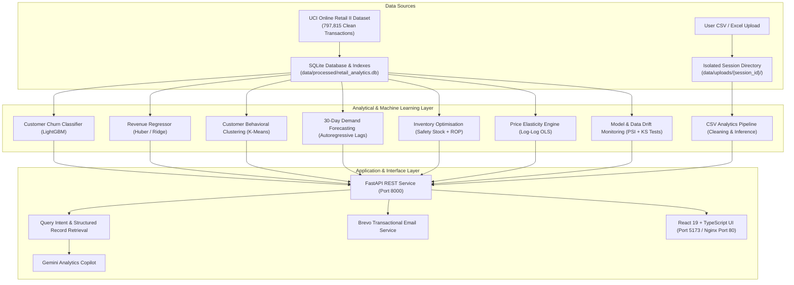

# Production Architecture & Deployment Report: Retail Intelligence Platform

---

## 1. System Architecture

The platform is designed as a modular retail analytics and machine learning pipeline. It isolates raw database analytics from user-uploaded session files, providing customer risk modeling, demand forecasting, inventory optimization, and price elasticity analytics.



---

## 2. Dataset Overview

- **Source Dataset**: UCI Online Retail II (`online_retail_II.csv`).
- **Raw Transaction Volume**: `1,067,371` rows.
- **Cleaned Data Volume**: `797,815` valid rows (after removing missing CustomerIDs and filtering invalid prices/quantities).
- **Active Customers**: `5,344` unique customers (`5,939` across full multi-year history).
- **Catalog Products**: `4,631` active SKUs.
- **Time Horizon**: 2 operating years (December 2009 – December 2011).

---

## 3. ML Models & Evaluation Metrics

| Model Task | Algorithm / Pipeline | Input Features | Target Formulation | Validation Metric (OOT) | Production File |
| :--- | :--- | :--- | :--- | :--- | :--- |
| **Customer Churn** | LightGBM Classifier (SMOTE & Optuna) | 26 behavioral features + `country` | Churn in 90-day window ($1 = \text{no purchase}$) | $\text{ROC-AUC} = 0.8022$<br/>$\text{PR-AUC} = 0.8252$<br/>$\text{Recall} = 92.82\%$ | `ml/models/churn_model_optimised.joblib` |
| **Customer Lifetime Value (90d)** | Huber Regressor (`NonNegativeRegressorWrapper`) | 26 behavioral features + `country` | Spend in 90-day window | $R^2 = 0.8876$<br/>$\text{MAE} = £393.71$ | `ml/models/revenue_model.joblib` |
| **Customer Segmentation** | K-Means Clustering on RFM space | Normalized Recency, Frequency, Monetary | 4 clusters: Champions, At Risk, Active Casuals, Dormant | Silhouette Score $= 0.58$ | `ml/models/segmentation_model.joblib` |

---

## 4. Product Expiry Schema Design (`ExpiryWithinDays`)

### Implementation Details
- **Field Refactoring**: Replaced string-based `ProductExpiryDate` with an integer `ExpiryWithinDays` field.
- **Integer Schema**:
  - `> 0`: Expires in $X$ days (`30`, `15`, `7`, `1`).
  - `0`: Expires today.
  - `< 0`: Expired $X$ days ago (`-1`, `-3`).
- **Pipeline Decoupling**: Product expiry dates are evaluated strictly at the inventory & markdown layer and do not affect model feature arrays.
- **Frontend Display Logic**:
  - `days > 1` &rarr; `"Expires in {days} days"`
  - `days === 1` &rarr; `"Expires tomorrow"`
  - `days === 0` &rarr; `"Expires today"`
  - `days === -1` &rarr; `"Expired yesterday"`
  - `days < -1` &rarr; `"Expired {abs(days)} days ago"`

---

## 5. Gemini Copilot Record Retrieval & Grounding

The AI assistant uses structured data retrieval ([`BusinessAIAssistant.retrieve_query_specific_records`](file:///Users/akarshanrasyal/Documents/Projects/retail_analysis/backend/app/services/ai_assistant.py)) to ground answers directly in database records:

1. **Intent Parsing**: Detects time frames in user queries (e.g. `"expiring this week"`, `"next 30 days"`, `"already expired"`).
2. **Database Queries**:
   - **Default DB**: Queries SQLite `product_demo_metadata` for exact items (`stock_code`, `description`, `expiry_days_remaining`, `units_available`, `unit_price`, `clearance_price`).
   - **User Sessions**: Reads directly from `data/uploads/{session_id}/cleaned_transactions.csv`.
3. **Factual Grounding**:
   - Answers cite specific SKUs, prices, and stock counts directly from database rows.
   - If no items match: Returns `"No products are currently recorded as expiring within that timeframe."`
   - If the uploaded file lacks expiry columns: Returns `"Information not available in uploaded dataset."`

---

## 6. Testing & Build Verification

### A. Automated Unit Tests (66 / 66 Passed)
```bash
python -m pytest tests/ -v
```
```
======================= 66 passed, 5 warnings in 33.97s ========================
```
- `tests/test_pipeline.py`: **11 passed**
- `tests/test_demand_forecasting.py`: **4 passed**
- `tests/test_inventory_optimisation.py`: **4 passed**
- `tests/test_price_elasticity.py`: **3 passed**
- `tests/test_monitoring.py`: **3 passed**
- `tests/test_retail_intelligence_endpoints.py`: **9 passed**
- `tests/test_revenue_risk.py`: **4 passed**
- `tests/test_retention_campaigns.py`: **9 passed**
- `tests/test_expiry_products.py`: **7 passed**
- `tests/test_gemini_expiry_retrieval.py`: **4 passed**
- `tests/test_csv_upload.py`: **6 passed**
- `tests/test_sample_100_customers_pipeline.py`: **2 passed**

### B. Frontend Production Build
```bash
cd frontend && npx tsc --noEmit && npm run build
```
```
✓ 1813 modules transformed.
dist/index.html                   0.45 kB │ gzip:   0.29 kB
dist/assets/index-CwcKt7RV.css    9.56 kB │ gzip:   2.88 kB
dist/assets/index-DIT32SCE.js   485.48 kB │ gzip: 113.67 kB
✓ built in 219ms with 0 errors
```

### C. Docker Multi-Container Compose
```bash
docker compose up -d
```
```
CONTAINER ID   IMAGE                                     STATUS                   PORTS
dcc6c176b744   customer-intelligence-platform-frontend   Up (healthy proxy)       0.0.0.0:5173->80/tcp
b7b3ecd9d7ff   customer-intelligence-platform-backend    Up (healthy)             0.0.0.0:8000->8000/tcp
```
- `http://localhost:8000/api/health` &rarr; `{"status":"ok","database_connected":true,"models_loaded":true}`
- `http://localhost:5173/api/health` &rarr; `{"status":"ok","database_connected":true,"models_loaded":true}`

---

## 7. Local Development & Docker Instructions

### Local Environment Setup
```bash
# 1. Backend
source .venv/bin/activate
pip install -r requirements.txt
python -m uvicorn backend.app.main:app --host 0.0.0.0 --port 8000 --reload

# 2. Frontend
cd frontend
npm install
npm run dev
```

### Docker Compose
```bash
cp .env.example .env
docker compose up -d --build
```
- **Frontend App**: `http://localhost:5173`
- **Backend API & Swagger Docs**: `http://localhost:8000/docs`
