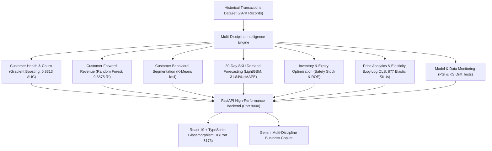

# 🛍️ AI Retail Customer Intelligence & Pricing Platform

An enterprise-grade, end-to-end **AI Retail Customer Intelligence & Pricing Platform** combining Customer Analytics, Churn Prediction, Product Demand Forecasting, Inventory Optimisation, Price Elasticity, and Real-Time Drift Monitoring.

Built on the UCI Online Retail II dataset (`1,067,371` raw records, `797,815` cleaned transactions across `5,939` customers and `4,646` catalog products).

---

## 🌟 Architecture & Capabilities



---

## 🔬 Core Disciplines & Machine Learning Models

### 1. Customer Intelligence & Revenue Risk
- **Zero Temporal Leakage**: Customer features computed strictly on or before observation cutoff date ($t \le T_{\text{cutoff}}$). Prediction targets evaluated on $(T_{\text{cutoff}}, T_{\text{cutoff}}+90\text{d}]$.
- **Multi-Cutoff Temporal Validation**: Evaluated across 3 chronological holdout cutoffs (Mar 2011, Jun 2011, Sep 2011).
- **Out-of-Time Churn Model**: Gradient Boosting Classifier (`ROC-AUC = 0.8313`, `PR-AUC = 0.8512`, `F1 = 0.8028`, `Brier = 0.1629`).
- **Customer Forward Value**: Random Forest Regressor ($R^2 = 0.8875$, $\text{MAE} = £400.53$).
- **Revenue at Risk**: $\text{Revenue at Risk} = \text{Churn Probability} \times \text{Predicted Future 90-Day Revenue}$.

### 2. Product Demand Forecasting (Next 30 Days)
- **Continuous Daily Time-Series**: 738 operational calendar days aggregated per SKU with 0-demand padding.
- **Autoregressive Feature Engineering**: Lags ($t-1, t-7, t-14, t-28$), rolling statistics ($7\text{d}, 14\text{d}, 28\text{d}$), day-of-week, and zero-demand ratios.
- **LightGBM Performance**: Achieves **31.84% sMAPE** (+18.6% relative improvement vs 30-day Moving Average baseline).
- **Empirical Prediction Intervals**: Generates 85% coverage prediction bands ($z = 1.44$) using validation residual standard error $\hat{\sigma}_{\text{res}}$.

### 3. Inventory & Expiry Optimisation
- **Lead-Time Demand & Uncertainty**: $\mu_{\text{LT}} = \mu_d \times L$, $\sigma_{\text{LT}} = \sigma_d \sqrt{L}$.
- **Safety Stock**: $\text{SS} = \lceil z \times \sigma_{\text{LT}} \rceil$ for selectable service levels (90%, 95%, 98%, 99%).
- **Reorder Point**: $\text{ROP} = \lceil \mu_{\text{LT}} + \text{SS} \rceil$.
- **Expiry Risk Protection**: Halts replenishment orders if current inventory exceeds expected demand prior to product expiration date.

### 4. Price Elasticity & Profit Optimization
- **Econometric Log-Log OLS Regression**:
  $$\ln(Q) = \alpha + \beta \ln(P) + \sum \gamma_m \text{Month}_m + \sum \delta_d \text{DOW}_d + \varepsilon$$
- **Catalog Coverage**: 4,363 eligible products analyzed; **877 multi-price elastic SKUs** identified with average $\beta = -1.85$.
- **Mathematical Optimization**: Computes revenue-maximizing and profit-maximizing optimal selling prices given user-specified unit cost.

### 5. Model & Data Monitoring Center
- **Population Stability Index (PSI)**: Quantile-binned feature drift detection ($\text{PSI} < 0.10$ healthy, $0.10 \le \text{PSI} < 0.25$ moderate, $\ge 0.25$ significant).
- **Two-Sample Kolmogorov-Smirnov (KS) Tests**: Monitored across all 26 customer behavioral features.
- **Demand Velocity Shift Anomaly Detection**: Flags products with $> 40\%$ change in weekly sales velocity.

---

## 📓 Interactive Data Science & ML Notebook Suite

The repository includes 13 complete, reproducible Data Science notebooks located in [`notebooks/`](notebooks/) and [`ml/notebooks/`](ml/notebooks/):

1. [`01_dataset_overview.ipynb`](notebooks/01_dataset_overview.ipynb) — Raw vs clean dataset audit, column dictionary, and distribution histograms.
2. [`02_data_quality_and_cleaning.ipynb`](notebooks/02_data_quality_and_cleaning.ipynb) — 5-step ETL sanitation funnel and missingness analysis.
3. [`03_sales_and_revenue_eda.ipynb`](notebooks/03_sales_and_revenue_eda.ipynb) — Revenue velocity, monthly seasonality, and order basket quantiles.
4. [`04_customer_eda.ipynb`](notebooks/04_customer_eda.ipynb) — RFM distributions, repeat vs 1-time buyer analysis, and Lorenz spend concentration.
5. [`05_product_and_demand_eda.ipynb`](notebooks/05_product_and_demand_eda.ipynb) — Top revenue SKUs and catalog price elasticity eligibility breakdown.
6. [`06_feature_engineering.ipynb`](notebooks/06_feature_engineering.ipynb) — Zero-leakage temporal feature vectors and correlation heatmap.
7. [`07_customer_segmentation.ipynb`](notebooks/07_customer_segmentation.ipynb) — K-Means RFM clustering ($k=4$, Silhouette 0.428) and 2D PCA projection.
8. [`08_churn_prediction.ipynb`](notebooks/08_churn_prediction.ipynb) — Gradient Boosting classifier (0.8313 ROC-AUC), Confusion Matrix, and SHAP explainability.
9. [`09_customer_revenue_prediction.ipynb`](notebooks/09_customer_revenue_prediction.ipynb) — Random Forest forward spend regressor ($R^2 = 0.8875$, £400.53 MAE).
10. [`10_demand_forecasting.ipynb`](notebooks/10_demand_forecasting.ipynb) — LightGBM 30-day daily demand forecasting with empirical confidence intervals.
11. [`11_price_elasticity.ipynb`](notebooks/11_price_elasticity.ipynb) — Econometric Log-Log OLS price sensitivity and Revenue vs Profit curves.
12. [`12_model_comparison_and_evaluation.ipynb`](notebooks/12_model_comparison_and_evaluation.ipynb) — Multi-cutoff temporal cross-validation benchmark synthesis.
13. [`13_error_analysis_and_business_insights.ipynb`](notebooks/13_error_analysis_and_business_insights.ipynb) — Residual diagnostics and executive retail actions.

See [`notebooks/README.md`](notebooks/README.md) and [`docs/DATA_SCIENCE_WORKFLOW.md`](docs/DATA_SCIENCE_WORKFLOW.md) for full documentation.

---

## 🚀 Quickstart & Running Locally

### Option 1: Docker Compose (Recommended)
```bash
# Build and run backend (port 8000) and frontend (port 5173)
docker compose up -d --build

# View container logs
docker compose logs -f
```

- **Frontend Dashboard:** [http://localhost:5173](http://localhost:5173)
- **Backend API:** [http://localhost:8000](http://localhost:8000)
- **API Documentation:** [http://localhost:8000/docs](http://localhost:8000/docs)

### Option 2: Local Python & Node Setup
```bash
# 1. Backend
python3 -m venv .venv
source .venv/bin/activate
pip install -r requirements.txt
python -m uvicorn backend.app.main:app --host 0.0.0.0 --port 8000 --reload

# 2. Frontend (in a new terminal)
cd frontend
npm install
npm run dev
```

---

## 🧪 Automated Testing

```bash
# Run all 115 Python backend tests
./.venv/bin/python -m pytest tests/ -v
./.venv/bin/python -m pytest backend/tests/ -v

# Run frontend TypeScript validation & build
cd frontend && npx tsc --noEmit && npm run build
```

---

## 📄 License & Provenance
- **Dataset**: UCI Machine Learning Repository — Online Retail II Dataset.
- **License**: MIT License.
