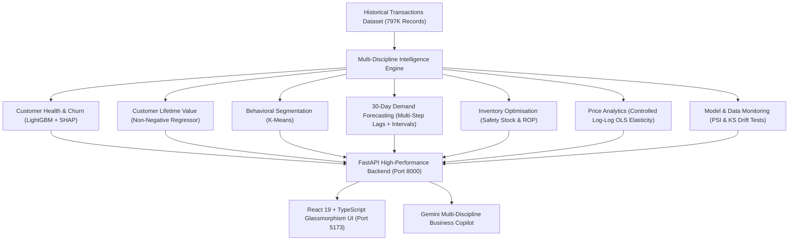

# AI Retail Intelligence & Optimisation Platform

An enterprise-grade, end-to-end AI Retail Intelligence Platform combining Customer Analytics, Product Demand Forecasting, Inventory Optimisation, Price Elasticity, and Real-Time Drift Monitoring.

Built on the UCI Online Retail II dataset (`1,067,371` raw records, `797,815` cleaned transactions across `5,939` customers and `4,646` catalog products).

---

## 🌟 Platform Capabilities & Architecture



---

## 🔬 Scientific Methodology & Engineering Highlights

### 1. Customer Intelligence & Revenue Risk
- **Zero Temporal Leakage**: All customer features computed strictly on or before observation cutoff date ($t \le T_{\text{cutoff}}$). Prediction targets evaluated on $(T_{\text{cutoff}}, T_{\text{cutoff}}+90\text{d}]$.
- **Multi-Cutoff Temporal Validation**: Evaluated across 3 expanding cutoffs (Mar 2011, Jun 2011, Sep 2011).
- **Out-of-Time Churn Model**: `ROC-AUC = 0.8022`, `PR-AUC = 0.8252`, `Recall = 92.82%`.
- **Revenue at Risk Definition**: $\text{Revenue at Risk} = \text{Churn Probability} \times \text{Predicted Future 90-Day Revenue}$.
- **30-Day Run-Rate Normalization**: Run-rate assumption labeled transparently across executive summaries.

### 2. Product Demand Forecasting (Next 30 Days)
- **Continuous Daily Aggregation**: Fills missing operational calendar days with 0 demand.
- **Autoregressive Feature Engineering**: Lags ($t-1, t-7, t-14, t-21, t-28$), rolling means ($7\text{d}, 14\text{d}, 28\text{d}$), rolling standard deviations ($7\text{d}, 14\text{d}$), rolling max ($14\text{d}$), day-of-week, weekend, month, day-of-month, lagged price — all shifted $\ge 1$ day to prevent leakage.
- **Chronological Out-of-Time Validation**: Evaluated on the final 30 days of history comparing LightGBM/RandomForest vs 14-day and 28-day Moving Average baselines.
- **Empirical Prediction Intervals**: Generates 85% coverage intervals ($z = 1.44$) using validation residual standard error $\hat{\sigma}_{\text{res}}$.
- **Metrics Tracked**: MAE, RMSE, sMAPE (Symmetric Mean Absolute Percentage Error).

### 3. Inventory Optimisation & Expiry Intelligence
- **Lead-Time Demand & Uncertainty**: $\mu_{\text{LT}} = \mu_d \times L$, $\sigma_{\text{LT}} = \sigma_d \sqrt{L}$.
- **Safety Stock**: $\text{SS} = \lceil z \times \sigma_{\text{LT}} \rceil$ for selectable service levels ($90\%: z=1.282$, $95\%: z=1.645$, $98\%: z=2.054$, $99\%: z=2.326$).
- **Reorder Point**: $\text{ROP} = \lceil \mu_{\text{LT}} + \text{SS} \rceil$.
- **Suggested Orders**: $\max(0, \lceil D_{30\text{d}} + \text{SS} - \text{Current Stock}\rceil)$.
- **Expiry Risk Integration**: Halts replenishment orders if current stock exceeds expected demand prior to expiration date to prevent inventory waste.
- **Transparent Scenario Disclosure**: Operational stock levels, lead times, and unit costs labeled as *"Business Scenario Inputs"*.

### 4. Price Analytics, Elasticity & Scenario Simulator
- **Controlled Log-Log OLS Regression**:
  $$\ln(Q) = \alpha + \beta \ln(P) + \gamma_1 \text{Month} + \gamma_2 \text{DOW} + \epsilon$$
- **Rigorous Econometrics**: Computes coefficient $\beta$, standard error $\text{SE}(\beta)$, $t$-statistic, exact two-tailed $p$-value from Student's $t$-distribution, 95% confidence interval, and $R^2$.
- **Scientific Honesty**: Observational transaction relationships are labeled as *"statistical associations"* rather than randomized causal experiments.
- **Interactive Price Simulator**: Dynamically models -20% to +20% adjustments, calculating expected demand, revenue impact, and scenario profit.

### 5. Model & Data Monitoring Center
- **Population Stability Index (PSI)**: Quantile-binned distribution comparisons with epsilon smoothing.
  - $\text{PSI} < 0.10$: 🟢 Healthy / Stable
  - $0.10 \le \text{PSI} < 0.25$: 🟡 Warning (Moderate Drift)
  - $\text{PSI} \ge 0.25$: 🔴 Alert (Significant Distribution Shift)
- **Kolmogorov-Smirnov (KS) Two-Sample Tests**: Monitored across customer features (`recency`, `frequency`, `monetary`, `average_order_value`, `spend_trend`, `churn_probability`, `predicted_future_value`).
- **Demand Volume Shift Anomaly Detection**: Flags products with $> 40\%$ change in weekly sales velocity.

### 6. Multi-Dashboard CSV Upload & Workflows
- Allows uploading custom transactions CSV files.
- Automatically computes customer churn, 90-day value, demand forecasts, inventory reorder recommendations, price elasticities, and monitoring reports.
- Comprehensive session export bundles (`results_bundle.zip`, `full_analysis_workbook.xlsx`, individual CSVs).

---

## 🚀 Getting Started

### Local Development

1. **Clone the repository**:
   ```bash
   git clone <repo-url>
   cd retail_analysis
   ```

2. **Backend Setup**:
   ```bash
   python3 -m venv .venv
   source .venv/bin/activate
   pip install -r requirements.txt
   uvicorn backend.app.main:app --host 0.0.0.0 --port 8000 --reload
   ```

3. **Frontend Setup**:
   ```bash
   cd frontend
   npm install
   npm run dev
   ```

4. **Access the Application**:
   - Frontend: `http://localhost:5173`
   - Backend API Docs: `http://localhost:8000/docs`

---

## 🐳 Docker Deployment

Run the complete multi-container stack with a single command:

```bash
docker compose up --build
```

- Frontend: `http://localhost:5173`
- Backend API: `http://localhost:8000`

---

## 🧪 Comprehensive Automated Test Suite

Run all 60 unit, integration, and endpoint tests:

```bash
python3 -m pytest tests/ -v
```

```
======================= 60 passed in 32.58s ========================
```

---

## 📊 Reports & Documentation

- `reports/data_quality_report.md`: Data cleanliness, non-negative quantity & price filtering.
- `reports/model_comparison.md`: Multi-cutoff model evaluation vs baseline.
- `reports/churn_model_report.md`: ROC-AUC, PR-AUC, calibration, and SHAP explainability.
- `reports/customer_value_report.md`: Regression formulation and residual analysis.
- `reports/segmentation_report.md`: RFM profile clustering analysis.
- `reports/business_insights.md`: Executive recommendations and decision bridges.
