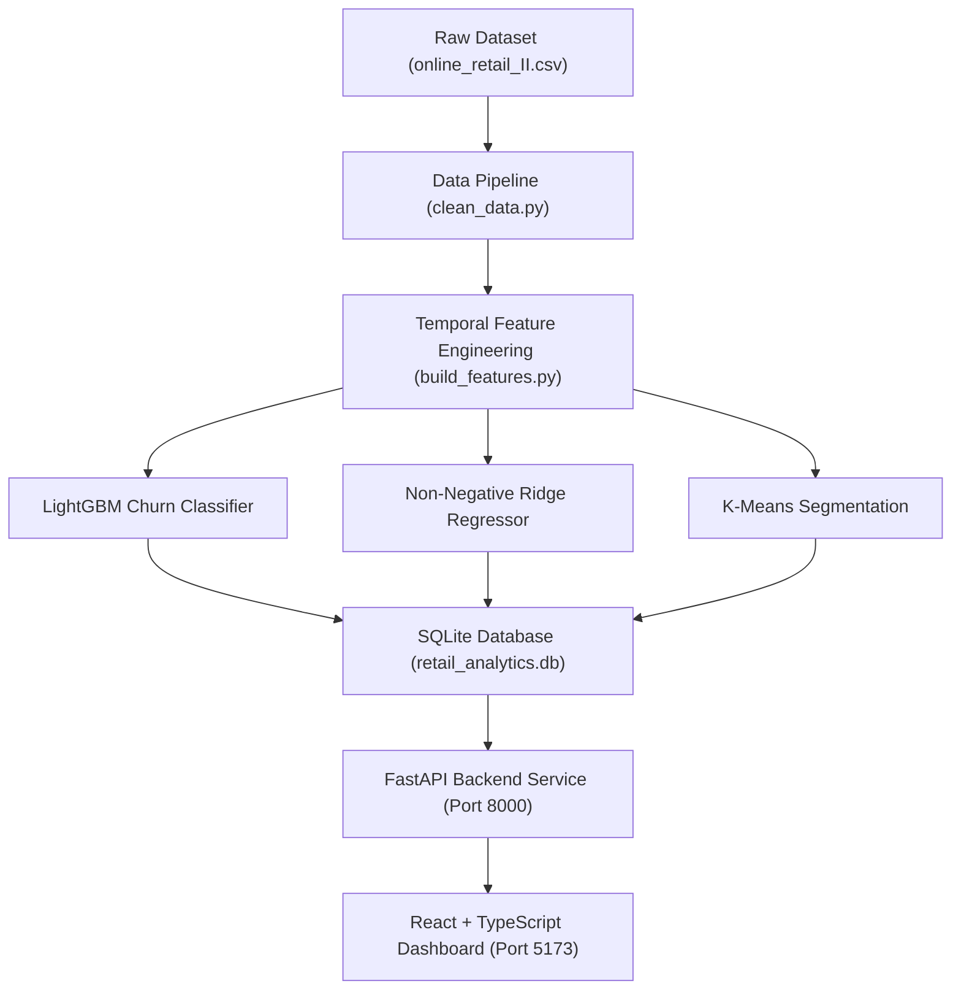

# Customer Intelligence & Revenue Risk Platform

An end-to-end production-grade Data Science & Machine Learning platform built on the UCI Online Retail II dataset (`1,067,371` raw transaction records).

It answers the core business question:
> **"Which customers are likely to stop purchasing, how valuable are those customers, why are they at risk, and what customer segments/actions should the business prioritize?"**

---

## 🔬 Rigorous Data Science Audit Highlights

- **Zero Target Leakage Verification**: Every single input feature is strictly computed on or before observation cutoff date ($t \le T_{cutoff}$). Targets are constructed strictly from future prediction window $(T_{cutoff}, T_{cutoff}+90\text{d}]$.
- **Multi-Cutoff Temporal Validation**: Evaluated across 3 distinct expanding observation cutoffs (Cutoff A: Mar 2011, Cutoff B: Jun 2011, Cutoff C: Sep 2011) and Out-Of-Time (OOT) test split.
- **Out-Of-Time (OOT) Performance**:
  - **LightGBM Churn Classifier**: `ROC-AUC = 0.8022`, `PR-AUC = 0.8252`, `Recall = 92.82%`, `Brier Score = 0.1601`.
  - **Non-Negative Ridge / Huber Regressor**: `R² = 0.8876`, `MAE = £393.71` to `£487.32`.
- **Revenue at Risk Definition**: `estimated_revenue_at_risk = churn_probability * predicted_future_90d_revenue`.
- **Data Scale**: 1,067,371 raw transaction records &rarr; 797,815 cleaned transactions across 5,939 unique customers.

---

## 🏗️ System Architecture



---

## 📁 Project Structure

```
retail_analysis/
├── data/
│   ├── raw/
│   │   └── online_retail_II.csv
│   └── processed/
│       ├── clean_transactions.parquet
│       ├── customer_features.parquet
│       ├── temporal_splits/              <-- Cutoffs A, B, C Parquet datasets
│       └── retail_analytics.db           <-- SQLite Database with indexes
├── ml/
│   ├── src/
│   │   ├── data/
│   │   │   ├── inspect_data.py
│   │   │   ├── clean_data.py
│   │   │   ├── audit_ds.py
│   │   │   └── populate_db.py
│   │   ├── features/
│   │   │   ├── build_features.py
│   │   │   └── build_multi_cutoff_features.py
│   │   └── models/
│   │       ├── train_all.py              <-- Churn, Revenue, Segmentation & SHAP
│   │       ├── evaluate_temporal_splits.py
│   │       └── wrappers.py               <-- NonNegativeRegressorWrapper
│   ├── models/
│   │   ├── churn_model.joblib
│   │   ├── revenue_model.joblib
│   │   └── segmentation_model.joblib
│   ├── reports/
│   │   ├── churn_metrics.json
│   │   ├── revenue_metrics.json
│   │   └── audited_metrics.json
│   └── requirements.txt
├── backend/
│   ├── app/
│   │   ├── api/endpoints.py              <-- REST API routes
│   │   ├── db/database.py               <-- SQLAlchemy session
│   │   ├── schemas/schemas.py           <-- Pydantic DTOs
│   │   ├── services/inference.py        <-- Live inference & SHAP explainability
│   │   └── main.py                      <-- FastAPI entrypoint
│   ├── tests/test_api.py
│   └── requirements.txt
├── frontend/
│   ├── src/
│   │   ├── components/                  <-- React Dashboard & Modals
│   │   ├── services/api.ts              <-- API client
│   │   ├── App.tsx
│   │   └── index.css                    <-- Glassmorphism Design System
│   ├── package.json
│   └── vite.config.ts
├── reports/                             <-- Data Science Audit Reports
│   ├── data_quality_report.md
│   ├── model_comparison.md
│   ├── churn_model_report.md
│   ├── customer_value_report.md
│   ├── segmentation_report.md
│   └── business_insights.md
├── scripts/
│   └── run_pipeline.sh
├── tests/
│   └── test_pipeline.py                 <-- 17 Automated Tests (Data, Leakage, OOT, API)
├── start.sh                             <-- Root application launcher
├── .gitignore
└── README.md
```

---

## ⚡ Quick Start Guide

### Prerequisites
- macOS / Linux
- Python 3.11 (configured in local `.venv`)
- Node.js v18+ & npm

### 1. Run Complete Automated Pipeline & Test Suite
```bash
./scripts/run_pipeline.sh
```

### 2. Launch Local Application (Backend + Frontend)
```bash
./start.sh
```

- **React Dashboard**: [http://localhost:5173](http://localhost:5173)
- **FastAPI API**: [http://localhost:8000](http://localhost:8000)
- **Interactive Swagger Docs**: [http://localhost:8000/docs](http://localhost:8000/docs)

---

## 🧪 Automated Test Suite (17 / 17 Passed)

Run full test suite:
```bash
PYTHONPATH=. .venv/bin/pytest tests/test_pipeline.py backend/tests/test_api.py
```
- **Data Integrity Tests**: Raw file check, non-null customer IDs, positive prices, line item revenue validation.
- **Leakage Safeguard Tests**: Verification that observation features use $t \le T_{cutoff}$ only and targets use $t > T_{cutoff}$ only.
- **Multi-Cutoff & Temporal Ordering Tests**: Expanding window size check and OOT dataset structure validation.
- **ML Inference Tests**: Probability bounds $[0, 1]$, non-negative revenue prediction bounds ($\ge 0.0$), K-means cluster assignment.
- **Backend API Tests**: 8 endpoints tested for HTTP 200, valid JSON schemas, and error handling.
